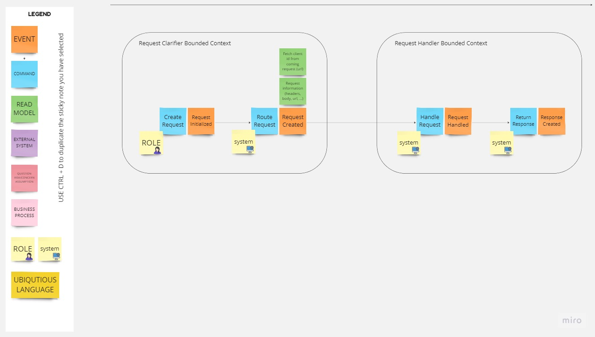

# Event Storming - ngrok

Date: 25-07-2023
Location: Tilburg

## Introduction
ngrok is software that can be used to expose applications worldwide without even having a public static IP. During this event storming, I worked on a solution similar to ngrok.

## Event Storming Overview
Event storming held by @saeedmaghdam, took almost 30 minutes to think about the problem and visualize it, and the goal behind this event storming was to improve creativity by event storming an idea.

## Key Discoveries
* We have four different events named `Request Initialized`, `Request Created`, `Request Handled` and `Response Created`.
* We have two bounded contexts named `Request Clarifier Bounded Context` and `Request Handler Bounded Context`
* It is better to have two bounded context, one is responsible to initialize and prepare the request, the other one is responsible to handle the request and create a response.

## Visual Representations

## Challenges and Uncertainties
* How should we proxy the request from user to end application?

## Next Steps
In the next step, we should sketch out and model the idea in order to create a PoC application.

## Conclusion
It was nice to have an event storming session for ngrok, because it clarified the problem and provided a nice vision of the problem. As a result, we now have this documentation, and we know what we should do for the next steps.